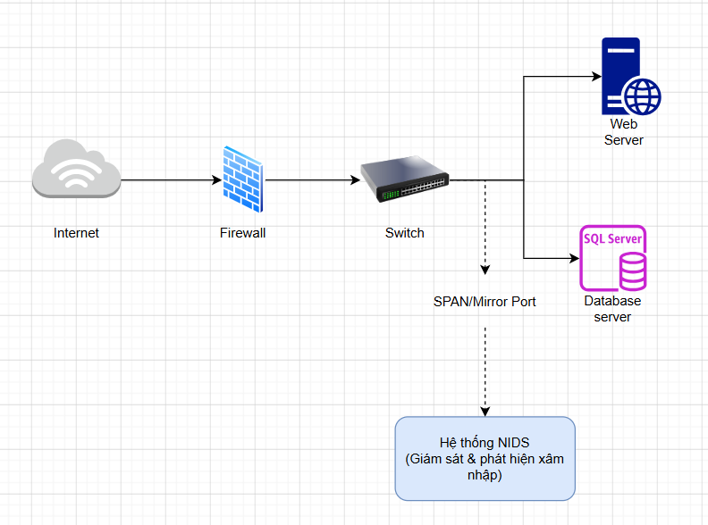

# NIDS - Hệ thống phát hiện xâm nhập mạng ứng dụng Machine Learning

## Team Members
Nguyễn Quỳnh Trang - 23010651

Phạm Thị Phương Anh - 23010706

Vũ Thị Khánh Vân - 23010679 

## 1. Giới thiệu đề tài

Đề tài xây dựng một hệ thống phát hiện xâm nhập mạng ở mức luồng lưu lượng mạng, nhằm hỗ trợ giám sát, phân tích và cảnh báo các hành vi bất thường trong hệ thống.

Trong môi trường mạng thực tế, các cuộc tấn công như quét cổng, từ chối dịch vụ, DDoS hoặc botnet có thể tạo ra những mẫu lưu lượng khác biệt so với hoạt động bình thường. Hệ thống NIDS được xây dựng trong đề tài này đóng vai trò như một thành phần giám sát thụ động, tiếp nhận dữ liệu lưu lượng mạng dạng CSV, phân tích các đặc trưng của luồng mạng và đưa ra cảnh báo về loại lưu lượng tương ứng.

Mô hình học máy được sử dụng như một công cụ hỗ trợ phát hiện bất thường, giúp hệ thống tự động phân loại lưu lượng mạng dựa trên các đặc trưng đã được trích xuất.

## 2. Mục tiêu đề tài

* Xây dựng hệ thống phát hiện xâm nhập mạng phục vụ giám sát an toàn hệ thống.
* Phân tích dữ liệu lưu lượng mạng dựa trên các đặc trưng của luồng mạng.
* Phát hiện và phân loại một số hành vi tấn công phổ biến trong môi trường mạng.
* Xây dựng giao diện demo cho phép tải file CSV và hiển thị kết quả cảnh báo.
* Hỗ trợ trực quan hóa kết quả để người dùng dễ dàng đánh giá mức độ rủi ro của lưu lượng.

## 3. Phạm vi hệ thống

Hệ thống tập trung vào phát hiện xâm nhập dựa trên dữ liệu luồng mạng đã được trích xuất sẵn. Dữ liệu đầu vào là file CSV chứa các đặc trưng của lưu lượng mạng.

Các nhóm hành vi hệ thống có thể nhận diện bao gồm:

* Lưu lượng bình thường (BENIGN)
* Quét cổng (PostScan)
* Các loại tấn công từ chối dịch vụ(DoS Hulk, DoS GoldenEye, DoS slowloris, DoS Slowhttptest )
* Tấn công DDoS
* Lưu lượng botnet(Bot)

Hệ thống không can thiệp trực tiếp vào đường truyền mạng thật, mà hoạt động theo hướng giám sát và hỗ trợ cảnh báo.

## 4. Bộ dữ liệu sử dụng

Đề tài sử dụng bộ dữ liệu CICIDS2017, đây là bộ dữ liệu phổ biến trong nghiên cứu phát hiện xâm nhập mạng. Bộ dữ liệu chứa các luồng lưu lượng bình thường và nhiều dạng tấn công khác nhau.

Trong quá trình thực hiện, nhóm sử dụng tập dữ liệu con(100000 mẫu và 500000 mẫu) được trích xuất từ bộ dữ liệu gốc để phù hợp với tài nguyên máy cá nhân và mục tiêu demo hệ thống.

Link gốc: https://www.kaggle.com/datasets/sweety18/cicids2017-full-dataset

Link drive các file chuyển đổi: https://drive.google.com/drive/folders/1qu9ENLiYQptNFE8Hng0Y6X5eA5ZY7AHw?usp=sharing

Cấu trúc dữ liệu trong dự án:

```text
data/
├── raw/          # Dữ liệu ban đầu
├── processed/    # Dữ liệu sau tiền xử lý và chia train/test
└── demo/         # Các file CSV dùng để demo trên giao diện web
```

Các file demo:

```text
demo_attack.csv
demo_benign.csv
demo_high_risk.csv
demo_mixed.csv
```

## 5. Đặc trưng lưu lượng mạng

Hệ thống sử dụng 12 đặc trưng đại diện cho hành vi của một luồng mạng:

1. Flow Duration
2. Flow Bytes/s
3. Flow Packets/s
4. Total Fwd Packets
5. Total Backward Packets
6. Packet Length Mean
7. Packet Length Std
8. Average Packet Size
9. Flow IAT Mean
10. Flow IAT Std
11. SYN Flag Count
12. ACK Flag Count

Các đặc trưng này giúp mô tả hành vi mạng theo nhiều khía cạnh khác nhau, bao gồm thời lượng luồng, tốc độ truyền dữ liệu, số lượng gói tin, kích thước gói tin và cờ TCP.

Ví dụ:

* Nhóm đặc trưng về kích thước gói tin có thể phản ánh các hành vi gửi gói tin lặp lại trong DoS hoặc DDoS.
* Nhóm đặc trưng về thời gian giữa các gói tin có thể hỗ trợ nhận diện hành vi quét cổng.
* Các cờ TCP như SYN và ACK giúp mô tả trạng thái kết nối trong quá trình truyền thông mạng.

## 6. Kiến trúc tham chiếu của hệ thống NIDS

Hình dưới đây mô tả vị trí triển khai tham chiếu của một hệ thống NIDS trong môi trường mạng thực tế.

Trong kiến trúc thực tế, lưu lượng mạng từ Internet đi qua Firewall và Switch trước khi đến các máy chủ như Web Server và Database Server. Hệ thống NIDS thường không được đặt trực tiếp trên đường truyền chính, mà nhận bản sao lưu lượng thông qua cơ chế SPAN/Mirror Port trên Switch để phục vụ giám sát và phát hiện bất thường.



Tuy nhiên, trong phạm vi đề tài này, nhóm chưa triển khai bước thu thập lưu lượng mạng trực tiếp từ Switch hoặc SPAN/Mirror Port. Thay vào đó, hệ thống sử dụng các file csv đã được trích xuất sẵn từ bộ dữ liệu CICIDS2017. Người dùng upload file csv lên giao diện web, sau đó hệ thống tiến hành kiểm tra dữ liệu, làm sạch, chọn đặc trưng, chuẩn hóa và dự đoán loại lưu lượng.

Do đó, sơ đồ trên được sử dụng để minh họa bối cảnh triển khai thực tế của NIDS, còn phần demo của đề tài tập trung vào giai đoạn phân tích dữ liệu luồng mạng đã có sẵn.

Luồng xử lý trong phạm vi demo:


CSV chứa đặc trưng lưu lượng mạng
→ Upload lên giao diện Streamlit
→ Kiểm tra dữ liệu đầu vào
→ Làm sạch dữ liệu
→ Chọn 12 đặc trưng
→ Chuẩn hóa dữ liệu
→ Dự đoán loại lưu lượng
→ Hiển thị kết quả cảnh báo

## 7. Thành phần chính của dự án

```text
BTL/
│
├── data/
│   ├── raw/
│   ├── processed/
│   └── demo/
│
├── notebooks/
│   ├── 01_EDA_Preprocessing.ipynb
│   ├── 02_Visualization.ipynb
│   └── 03_Modeling.ipynb
│
├── outputs/
│   ├── figures/
│   └── models/
│
├── src/
│   ├── config.py
│   ├── cre_demo.py
│   └── preprocessing.py
│
├── app.py
├── requirements.txt
├── README.md
└── .gitignore
```

Ý nghĩa các thư mục chính:

* `data/raw/`: chứa dữ liệu ban đầu.
* `data/processed/`: chứa dữ liệu sau tiền xử lý.
* `data/demo/`: chứa các file CSV dùng để kiểm thử giao diện.
* `notebooks/`: chứa các bước khám phá dữ liệu, trực quan hóa và xây dựng mô hình.
* `outputs/figures/`: chứa các biểu đồ trực quan hoá từ các đặc trưng được chọn trong bộ dữ liệu.
* `outputs/models/`: chứa mô hình và scaler đã lưu.
* `src/`: chứa các hàm xử lý được tách riêng để tái sử dụng và tạo các file demo cho web.
* `app.py`: file chính chạy giao diện Streamlit.

## 8. Chức năng của hệ thống demo

Giao diện web được xây dựng bằng Streamlit gồm 3 phần chính:

### 8.1. Giới thiệu hệ thống

Trang này trình bày vai trò của NIDS, phạm vi giám sát, kiến trúc triển khai và luồng xử lý dữ liệu,....

### 8.2. Trung tâm dự đoán

Người dùng có thể upload file CSV chứa dữ liệu lưu lượng mạng. Hệ thống sẽ kiểm tra dữ liệu đầu vào, xử lý các giá trị không hợp lệ, chọn đúng 12 đặc trưng và đưa ra kết quả phân loại.

Kết quả bao gồm:

* Bảng dữ liệu sau dự đoán
* Số lượng lưu lượng bình thường
* Số lượng lưu lượng bất thường
* Tỷ lệ cảnh báo
* Biểu đồ phân bố kết quả dự đoán
* Bảng phân từng loại tấn công được phát hiện
* Nút tải file dự đoán về theo dạng csv hoặc xuất log dạng json
### 8.3. Phân tích hiệu suất

Trang này dùng để đánh giá khả năng phát hiện của hệ thống NIDS trên tập kiểm thử:

- Hiển thị các chỉ số tổng quan như Accuracy, tỷ lệ cảnh báo tấn công và độ trễ suy luận.
- Đánh giá từng loại lưu lượng bằng Precision, Recall và F1-score.
- Xác định các nhãn có nguy cơ bị bỏ sót cao, ví dụ như Bot hoặc Infiltration.
- Hiển thị trọng số đóng góp của 12 đặc trưng để giải thích yếu tố ảnh hưởng đến kết quả dự đoán.

## 9. Mô hình phát hiện

Trong đề tài, nhóm thử nghiệm một số mô hình phân loại và lựa chọn Random Forest do cho kết quả tốt trên tập kiểm thử.

Mô hình được sử dụng nhằm hỗ trợ hệ thống nhận diện mẫu hành vi mạng dựa trên các đặc trưng đã được trích xuất. 
Các file mô hình đã lưu:

```text
outputs/models/random_forest.pkl #file mô hình sau khi huấn luyện
outputs/models/scaler.pkl #file chuẩn hoá 
```

## 10. Kết quả đạt được

Hệ thống đã hoàn thành các nội dung chính:

* Tiền xử lý và làm sạch dữ liệu lưu lượng mạng.
* Lựa chọn 12 đặc trưng phục vụ phát hiện xâm nhập.
* Huấn luyện mô hình phân loại lưu lượng mạng.
* Xây dựng giao diện web demo bằng Streamlit.
* Cho phép upload file CSV và hiển thị kết quả cảnh báo.
* Trực quan hóa phân bố nhãn dự đoán và hiệu suất hệ thống.

Mô hình Random Forest đạt độ chính xác kiểm thử khoảng 99.31% trên tập dữ liệu đã chuẩn bị.

## 11. Hướng dẫn cài đặt và chạy chương trình

### 11.1. Clone project

```bash
git clone https://github.com/CNTT7-phenikaa/BTL_Bao_mat_ung_dung_he_thong
cd BTL_Bao_mat_ung_dung_he_thong
```

### 11.2. Tạo môi trường ảo (Chạy trên Command Prompt)

```bash
python -m venv venv
```

Kích hoạt môi trường ảo trên Windows:

```bash
venv\Scripts\activate
```

Kích hoạt môi trường ảo trên macOS/Linux:

```bash
source venv/bin/activate
```

### 11.3. Cài đặt thư viện

```bash
pip install -r requirements.txt
```
### 11.4. Chuẩn bị cho giao diện demo
Do các file dữ liệu (.csv) và các file mô hình (.pkl) không được đẩy lên Github, vì vậy cần làm theo các bước sau để tạo lại các file cần cho demo:

Vào đường dẫn link drive các file chuyển đổi: https://drive.google.com/drive/folders/1qu9ENLiYQptNFE8Hng0Y6X5eA5ZY7AHw?usp=sharing

Thực hiện download file dữ liệu 100000 mẫu và 500000 mẫu đã chuyển đổi

Tạo thư mục data/raw, giải nén các file dữ liệu vừa download vào thư mục

Chạy file `01_EDA_Preprocessing.ipynb` để lưu file chuẩn hoá dữ liệu
```bash
cd notebooks
python 01_EDA_Preprocessing.ipynb
```

hạy file `03_Modeling.ipynb` để lưu file mô hình sau huấn luyện
```bash
cd notebooks
python 03_Modeling.ipynb
```

hạy file `cre_demo.py` để tạo các file demo trên giao diện
```bash
cd src
python cre_demo.py
```

### 11.5. Chạy giao diện demo

```bash
python -m streamlit run app.py
```

(Điền email nếu có yêu cầu)

## 12. Hướng dẫn sử dụng

1. Mở giao diện Streamlit.
2. Chọn trang `Trung tâm dự đoán`.
3. Upload file CSV trong thư mục `data/demo/`.
4. Hệ thống kiểm tra dữ liệu đầu vào.
5. Nếu file hợp lệ, ấn nút "Phân tích lưu lượng mạng" để hệ thống thực hiện phân loại lưu lượng.
6. Kết quả cảnh báo được hiển thị trên giao diện.

## 13. Công nghệ sử dụng

* Python
* Pandas
* NumPy
* Scikit-learn
* Streamlit
* Matplotlib
* Seaborn
* Joblib
* Git/GitHub

## 14. Kết luận

Đề tài đã xây dựng được một hệ thống demo phát hiện xâm nhập mạng dựa trên phân tích đặc trưng lưu lượng. Hệ thống có khả năng tiếp nhận dữ liệu CSV, xử lý dữ liệu, phân loại lưu lượng và hiển thị cảnh báo trực quan cho người dùng.

Thông qua đề tài, nhóm đã mô phỏng được quy trình cơ bản của một hệ thống NIDS, từ xử lý dữ liệu lưu lượng mạng đến phát hiện và cảnh báo các hành vi bất thường trong hệ thống.


